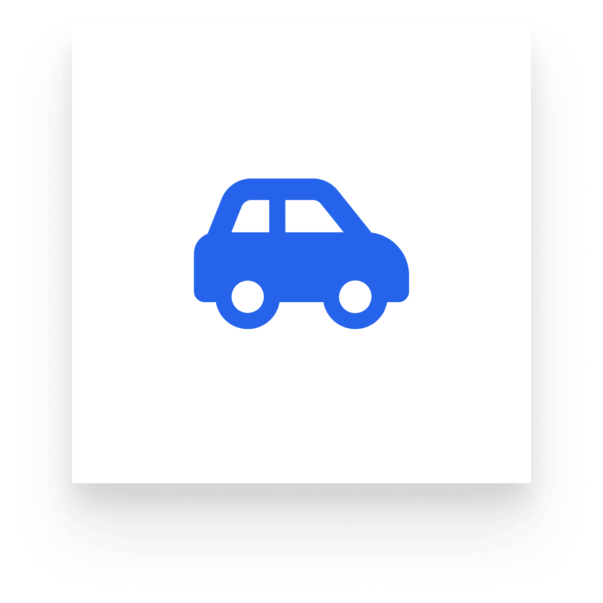
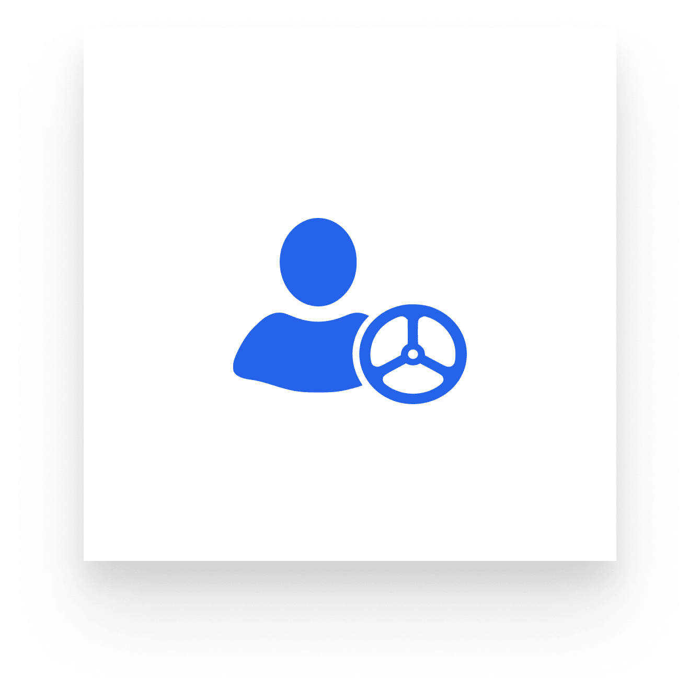

# 🚗 FreeDriver – Mobile Applications
## 🔖 App Logos

**Owner App**  

**Driver App**  

**GPS App**  

---

## 🧭 Project Overview

This is a mobile-based **car rental system** connecting **car owners** and **renters**, developed with a clean architecture approach across three dedicated applications:

- 📱 **PCDACO-Owner**: For vehicle owners to manage cars, availability, and rental history.
- 🚘 **PCDACO-Driver**: For customers (drivers) to search, book
- 📡 **Track-location-app**: Installed on a GPS device inside the vehicle to provide real-time location tracking.

The system emphasizes **user convenience**, **real-time vehicle tracking**, and **secure identity verification**, including automatic driver license validation using AI.

This project was built by a team of **four members**, with **three backend developers** and **one frontend developer** (me), responsible for the **entire mobile app development** across all three apps.

---

## 🧰 Technologies Used

### 📦 Core Libraries
- [**Expo**](https://expo.dev) – React Native development framework  
- [**EAS (Expo Application Services)**](https://docs.expo.dev/eas/) – For builds, OTA updates, and app deployments  
- [**NativeWind UI**](https://www.nativewind.dev) – Tailwind CSS styling for React Native  
- [**Zustand**](https://zustand-demo.pmnd.rs) – Lightweight and scalable state management  
- [**Zod**](https://zod.dev) – Schema validation and type-safe form handling  
- [**TanStack Query (React Query)**](https://tanstack.com/query) – Async data fetching, caching, and background syncing  
- [**Mapbox**](https://www.mapbox.com/) – High-performance mapping and geolocation for mobile apps

### ☁️ Third-Party Services
- [**FPT AI**](https://fpt.ai/) – Used for automated driver license validation using OCR

---

## 📂 Project Structure

📦 rental-mobile-app/
├── 📁 PCDACO-Driver/          # Mobile app for drivers/renters
├── 📁 PCDACO-Owner/           # Mobile app for car owners
├── 📁 Track-location-app/     # GPS tracking app for vehicles
└── README.md

---

<!-- End of README -->
